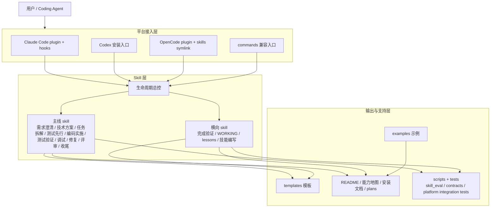

# Skill 能力地图

## 文档目的

本文档用于说明本仓库各个 skill 的职责边界、适用时机、上下游关系，以及 `WORKING` / `lessons` 在整个体系中的位置。

它既服务仓库维护者，也服务实际使用者：

- 对维护者：减少 skill 语义漂移、职责重叠和后续演进歧义
- 对使用者：帮助快速判断“当前问题该先用哪个 skill”

## 总体结构

本仓库的能力可分为五层：

1. 生命周期主线
2. 执行纪律
3. 文档决策增强
4. 横向记录机制
5. 元能力（技能体系自身的构建与维护）

## 仓库分层架构图

### 图解说明

- 平台接入层负责让不同 agent 发现并加载这套 skill
- `生命周期总控` 是统一入口，负责把任务分流到主线或横向 skill
- 模板、示例、文档和校验层共同支撑 skill 的可用性、可维护性和可验证性
- 这意味着本仓库不是单纯 prompt 集合，而是一个完整的 agent 工作流产品骨架

### 生命周期主线

- `生命周期总控`
- `需求澄清`
- `技术方案`
- `任务拆解`
- `测试先行`
- `编码实施`
- `测试验证`
- `代码评审`（发起评审）
- `接收评审`（接收评审反馈）
- `系统化调试`
- `缺陷修复`
- `交付收尾`

### 执行纪律

- `完成验证`（全局门控：没有验证证据就不许宣称完成）

### 文档决策增强

- `需求澄清`
- `技术方案`
- `任务拆解`

### 横向记录机制

- `WORKING`
- `lessons`

### 元能力

- `技能编写`

## 快速选择

### 当你不确定现在该做什么

先用 `生命周期总控`。

### 当目标、边界、验收还不清楚

用 `需求澄清`。

### 当需求清楚，但实现路径和取舍还没定

用 `技术方案`。

### 当方案已经确定，但工作太大、顺序不清

用 `任务拆解`。

### 当新增功能、修 bug、改行为，准备进入实现

优先用 `测试先行`。

### 当测试约束已建立，准备做最小实现

用 `编码实施`。

### 当需要证明结果、对照契约、确认回归

用 `测试验证`。

### 当现象已出现，但根因未明、复现不稳

先用 `系统化调试`。

### 当根因较明确，准备进入最小修复

用 `缺陷修复`。

### 当需要质量把关与问题分级

用 `代码评审`。

### 当收到评审反馈需要处理

用 `接收评审`。

### 当准备合并、交付、总结与收尾

用 `交付收尾`。

### 当项目中出现新决策、新阻塞、新实测结论

更新 `WORKING`。

### 当形成可复用经验、反模式、默认做法

沉淀到 `lessons`。

### 当需要新建或修改 skill

用 `技能编写`。

## 生命周期主线说明

### `生命周期总控`

**职责**
- 判断当前任务处于哪个阶段
- 推荐下一个最合适的下游 skill
- 提醒是否需要更新 `WORKING` 或 `lessons`

**适用时机**
- 用户只描述问题，但没有明确当前阶段
- 多个 skill 都可能适用，需要先分流

**不负责**
- 不直接替代下游 skill 执行细节
- 不把自己扩张成“万能 skill”

**上游 / 下游**
- 上游：用户原始请求
- 下游：所有主线 skill

### `需求澄清`

**职责**
- 把模糊目标整理成可设计、可验收的需求定义
- 明确背景、目标、范围、非目标、约束与待确认问题

**适用时机**
- 目标模糊
- 范围边界不清
- 验收标准不明确

**不负责**
- 不直接给出详细技术实现
- 不代替技术方案选型

**典型下游**
- `技术方案`

### `技术方案`

**职责**
- 在需求明确后形成可评审的技术设计
- 比较候选方案，明确取舍、模块边界、关键流程与契约

**适用时机**
- 要进入实现，但还没有统一技术路径
- 存在方案比较、接口设计、风险权衡

**不负责**
- 不替代任务拆解
- 不直接进入编码细节

**典型下游**
- `任务拆解`
- `编码实施`

### `任务拆解`

**职责**
- 把设计决策转成可执行、可验证、可追踪的任务清单
- 标注依赖、顺序、验证方式与延后项

**适用时机**
- 工作跨多个模块
- 风险较大，需要分阶段推进
- 执行顺序不清

**不负责**
- 不重新定义需求
- 不重做方案选型

**典型下游**
- `测试先行`
- `编码实施`

### `测试先行`

**职责**
- 在行为变更进入实现前先建立最小测试约束
- 先写 failing test，再推动最小实现

**适用时机**
- 新增功能
- 修复缺陷
- 修改已有行为
- 重构中涉及可观察行为变化

**不负责**
- 不替代最终的 `测试验证`
- 不负责输出交付级验证结论

**典型下游**
- `编码实施`
- `测试验证`

### `编码实施`

**职责**
- 在边界清晰、测试约束已建立后做最小实现
- 收口代码、测试、配置与文档改动

**适用时机**
- 当前任务已具备明确目标和完成标准
- 已适合进入实际改动

**不负责**
- 不替代需求和方案判断
- 不在需要测试先行的行为变更上直接越级

**典型下游**
- `测试验证`
- `代码评审`

### `测试验证`

**职责**
- 证明结果是否满足验收标准与契约要求
- 说明测试结果、验证缺口与未覆盖风险

**适用时机**
- 需要确认是否可进入下一阶段
- 需要对照 API / 模块契约做验证
- 需要做回归、边界或异常验证

**不负责**
- 不替代 `测试先行`
- 不替代 `系统化调试`
- 不扩写实现

**典型下游**
- `代码评审`
- `交付收尾`

### `代码评审`（发起评审）

**职责**
- 从质量、风险、严重级别角度审视结果
- 区分必须修复的问题与可选优化项
- 要求发起前必须已通过 `完成验证`

**适用时机**
- 实现与验证已基本完成
- 需要在交付前把关质量

**不负责**
- 不代替实现
- 不代替最终交付说明
- 不处理评审反馈的执行（由 `接收评审` 负责）

**典型下游**
- `接收评审`（如收到反馈）
- `交付收尾`
- 必要时回退到 `编码实施` 或 `测试验证`

### `接收评审`

**职责**
- 对收到的评审反馈做技术评估
- 按优先级实现合理的修改，推回不合理的建议
- 确保每条修改都经过验证

**适用时机**
- 收到 review 意见需要决定如何响应
- 需要区分哪些反馈应采纳、哪些应推回
- 需要避免表演性同意和盲目实现

**不负责**
- 不发起评审（由 `代码评审` 负责）
- 不扩大当前改动范围

**典型下游**
- `编码实施`（如需大范围修改）
- `测试验证`（修改后验证）
- `交付收尾`

### `系统化调试`

**职责**
- 在 bug、异常、回归、flaky 问题场景下先做定位
- 区分事实、证据、假设、排除项与停止条件

**适用时机**
- 根因未明
- 复现条件不稳
- 当前信息不足以直接修复

**不负责**
- 不直接承担修复实现
- 不把症状缓解误当成根因已解决

**典型下游**
- `缺陷修复`
- 必要时回看 `技术方案` 或上游文档

### `缺陷修复`

**职责**
- 在定位较明确后，设计并执行最小修复
- 回归验证修复是否有效，并考虑防回归措施

**适用时机**
- 根因较明确
- 已具备进入代码改动的条件

**不负责**
- 不替代根因定位
- 不在证据不足时直接拍脑袋修复

**典型下游**
- `测试验证`
- `代码评审`

### `交付收尾`

**职责**
- 汇总本次交付内容、验证结果、剩余风险与后续建议
- 形成可交接、可说明、可追溯的收尾信息

**适用时机**
- 合并前
- 发布前
- 任务阶段完成时

**不负责**
- 不替代测试与评审
- 不在证据不足时宣布完成

## 执行纪律说明

### `完成验证`

**职责**
- 在任何完成断言之前插入一道强制 gate
- 确保所有"通过"、"完成"、"已修复"等声明都有验证证据支撑

**适用时机**
- **始终。** 在任何变体的完成/成功/通过断言之前。
- 嵌入在所有其他 skill 的完成环节中。

**不负责**
- 不产出独立文档
- 不替代具体的测试验证或代码评审

**门控流程**
1. 确定：什么命令能证明这个断言？
2. 执行：完整运行该命令（必须是新鲜的）
3. 阅读：完整输出，检查退出码
4. 确认：输出是否支持断言？
5. 然后：做出断言

### 强制依赖链

以下依赖关系是强制的，不可跳过：

| 下游 skill | 前置条件 | 强制级别 |
|-----------|----------|----------|
| 编码实施 | 涉及行为变更时，必须先通过「测试先行」 | 必须 |
| 编码实施 | 任务有明确的完成标准和文件路径 | 必须 |
| 代码评审 | 必须先通过「完成验证」，有验证证据 | 必须 |
| 交付收尾 | 必须先通过「完成验证」，有验证证据 | 必须 |
| 缺陷修复 | 必须先通过「系统化调试」定位根因 | 必须 |

## 横向记录机制说明

### `WORKING`

**职责**
- 记录项目进行中的事实、决策、阻塞、实测结论与临时约束

**适用时机**
- 出现新决策
- 出现新阻塞
- 出现实测结果
- 需要记录当前状态变化

**不负责**
- 不写成 PRD / RFC
- 不沉淀泛化经验

### `lessons`

**职责**
- 沉淀可复用经验、反模式、默认做法与 review 结论

**适用时机**
- 出现可迁移的经验或教训
- 某类问题反复出现
- 形成了值得复用的工程原则

**不负责**
- 不记录项目即时动态
- 不替代 `WORKING`

## 元能力说明

### `技能编写`

**职责**
- 用 TDD 方法编写新 skill 或加固已有 skill
- 通过压力场景测试验证 skill 有效性
- 从基线行为中提取合理化借口并构建反驳

**适用时机**
- 需要新建 skill
- 已有 skill 在某些场景下约束力不足
- agent 在特定场景下反复偏离预期

**不负责**
- 不替代具体的生命周期 skill 执行
- 不负责 skill 的日常使用，只负责创建和维护

**上游 / 下游**
- 上游：实际使用中发现的 agent 行为偏离、`lessons` 中沉淀的反模式
- 下游：新的或加固的 SKILL.md、行为契约测试用例

## 典型链路

### 新增功能

`生命周期总控 → 需求澄清 → 技术方案 → 任务拆解 → 测试先行 → 编码实施 → 测试验证 → 代码评审 → [接收评审 →] 交付收尾`

### 修复缺陷（根因未明）

`生命周期总控 → 系统化调试 → 缺陷修复 → 测试验证 → 代码评审 → [接收评审 →] 交付收尾`

### 重构模块

`生命周期总控 → 需求澄清 → 技术方案 → 任务拆解 → 测试先行（如涉及行为变化） → 编码实施 → 测试验证 → 代码评审 → [接收评审 →] 交付收尾`

注：`[接收评审 →]` 表示如收到评审反馈则触发此步骤。`完成验证` 是全局纪律，嵌入在每个声称完成的环节中，不单独列入链路。

## 维护原则

- 新增 skill 前，先明确它是否真能补足现有边界，而不是和旧 skill 重叠。
- 修改 skill 时，优先检查它的上游 / 下游是否会因此变化。
- 若某个 skill 的职责无法用一句话说清，通常说明边界还不够稳。
- 若某个问题可以通过补充 `WORKING` / `lessons` 解决，就不要盲目新增新 skill。
